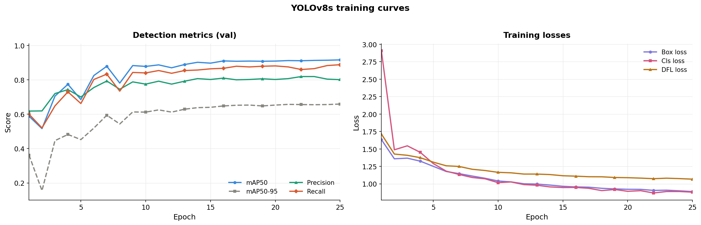
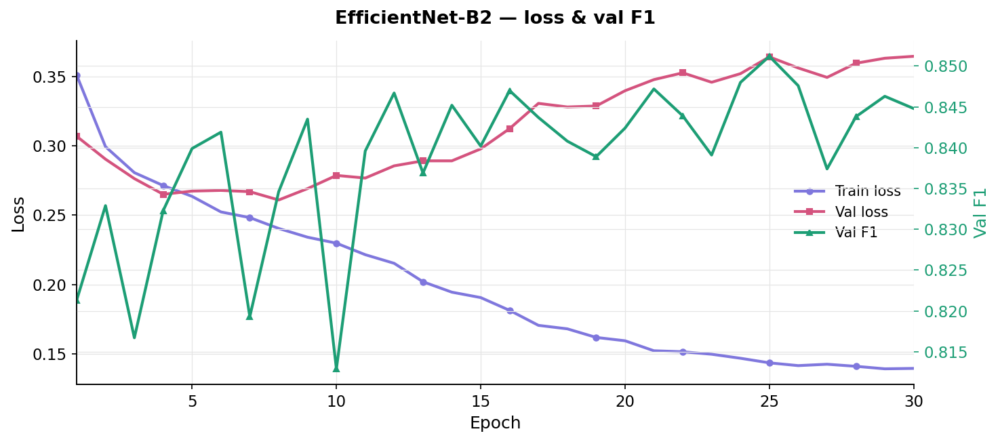

# Mitosis Detector — Two-Stage Pipeline

This project presents a two-stage pipeline for mitotic figure detection in whole-slide pathology images: first maximize candidate detection sensitivity, then refine predictions to remove false positives.

The input is a gigabyte-scale whole-slide DICOM image. The output is the precise coordinates of each mitotic figure on the slide, automating work that is usually done manually by pathologists.

The final system combines:
- a high-recall YOLO detector (candidate generation), and
- an EfficientNet-B2 classifier trained on hard negatives (false-positive reduction).

Final performance: **F1 = 0.7738** on 11 fully held-out test slides.

## Dataset

32 whole-slide DICOM images (21 training + 11 test) with 262,481 expert annotations across all 32 slides. This project uses the 21 training slides.

**Source:** [Training](https://www.kaggle.com/datasets/marcaubreville/mitosis-wsi-ccmct-training-set) | [Testing](https://www.kaggle.com/datasets/marcaubreville/mitosis-wsi-ccmct-test-set/data)

**Reference:** Bertram, C. A., Aubreville, M., Marzahl, C., Maier, A., & Klopfleisch, R. (2019). A large-scale dataset for mitotic figure assessment on whole slide images of canine cutaneous mast cell tumor. *Scientific Data*, 6(274), 1–9.

**Annotation classes:**

| Class ID | Name |
|----------|------|
| 1 | Granulocyte |
| 2 | Mitotic figure |
| 3 | Tumor cell |
| 4 | Other/ambiguous |
| 5 | Binucleated cell |
| 6 | Multinucleated cell |
| 7 | Mitotic figure lookalike |

Classes 5 and 6 were defined in the annotation schema but no cells of those classes were annotated in the training or testing slides.

---

## Method Development

### First Approach: Single-Stage Pipeline

The initial baseline treated the task as binary patch classification:
"Given a 64×64 patch centered on an annotated cell, is it mitotic or not?"

**Data extraction:** Each DICOM whole-slide image is tile-based and can be several gigabytes in size. The pipeline streamed through all 21 training slides tile by tile, mapped each annotation's slide-level `(x, y)` coordinate to its tile index, and extracted a 64×64 patch centered on each annotated cell. Zero-padding was applied for patches near tile edges.

**EDA and patch cleaning:** 1,000 patches per class were sampled to assess quality. Two recurring issues were observed:
- excessive black padding from tile edges
- near-blank tissue patches with almost no cell content

| Class | Black padding >10% | Plain (intensity >220) |
|-------|-------------------|------------------------|
| Granulocyte | 18.2% | 46.1% |
| Mitotic figure | 17.7% | 27.6% |
| Tumor cell | 19.4% | 31.1% |
| Ambiguous | 19.1% | 37.1% |
| Mitotic figure lookalike | 19.0% | 27.7% |

Both filters were applied to all 146,230 patches:

| Class | Total | Clean | Dropped |
|-------|-------|-------|---------|
| Granulocyte (1) | 35,331 | 13,611 | 21,720 |
| Mitotic figure (2) | 21,036 | 11,954 | 9,082 |
| Tumor cell (3) | 45,178 | 21,995 | 23,183 |
| Ambiguous (4) | 41,656 | 18,127 | 23,529 |
| Mitotic figure lookalike (7) | 3,029 | 1,640 | 1,389 |
| **Total** | **146,230** | **67,327** | **78,903** |

After cleaning, **54% of patches were dropped**.  
Class 4 (ambiguous) was excluded from training because label uncertainty introduces noise.

Final training data: **49,200 patches** (11,954 mitotic, 37,246 non-mitotic), class imbalance **3.1:1**.

**Slide-level splits:** Patches were not split randomly. If patches from the same slide appear in both train and validation sets, the model can memorize slide-specific staining and still appear to perform well on validation. That is memorization, not generalization.

All patches from a given slide were assigned to one split only.  
Slide 23 (zero mitotic cells) was deliberately placed in the validation set. A model that truly learned mitosis morphology should produce very few false positives on this slide.

The counts below come from the original single-stage patch extraction and show why slide-level splitting matters:

| Slide | Mitotic | Non-mitotic | Total | Split |
|-------|---------|-------------|-------|-------|
| 4 | 2,875 | 6,470 | 9,345 | Train |
| 7 | 948 | 3,485 | 4,433 | Val |
| 8 | 54 | 237 | 291 | Val |
| 12 | 847 | 3,351 | 4,198 | Train |
| 13 | 685 | 2,306 | 2,991 | Train |
| 14 | 1,183 | 1,708 | 2,891 | Val |
| 15 | 188 | 885 | 1,073 | Train |
| 17 | 371 | 1,774 | 2,145 | Train |
| 19 | 2,184 | 2,402 | 4,586 | Train |
| 21 | 2,547 | 3,672 | 6,219 | Train |
| 22 | 26 | 644 | 670 | Train |
| 23 | 0 | 1,328 | 1,328 | Val |
| 24 | 2 | 748 | 750 | Train |
| 25 | 7 | 1,077 | 1,084 | Train |
| 26 | 1 | 323 | 324 | Train |
| 28 | 0 | 606 | 606 | Train |
| 29 | 7 | 1,940 | 1,947 | Train |
| 32 | 6 | 1,412 | 1,418 | Train |
| 34 | 0 | 767 | 767 | Train |
| 35 | 19 | 1,351 | 1,370 | Train |
| 36 | 4 | 760 | 764 | Train |

| Split | Slides | Mitotic | Non-mitotic | Total |
|-------|--------|---------|-------------|-------|
| Train (17 slides) | 4, 12, 13, 15, 17, 19, 21, 22, 24, 25, 26, 28, 29, 32, 34, 35, 36 | 9,769 | 30,488 | 40,257 |
| Validation (4 slides) | 7, 8, 14, 23 | 2,185 | 6,758 | 8,943 |

**Model architecture:** ResNet-18 pretrained on ImageNet, with the final fully connected layer replaced for binary classification. Each 64×64 patch was resized to 224×224 before being fed into the network.

| Setting | Value |
|---------|-------|
| Model | ResNet-18 (ImageNet pretrained) |
| Input size | 224×224 (resized from 64×64) |
| Optimizer | Adam, lr=1e-4 |
| Loss | BCEWithLogitsLoss, pos_weight=3.12 |
| LR scheduler | ReduceLROnPlateau, mode=max, factor=0.5, patience=2 (stepping on F1) |
| Decision threshold | 0.51 |

Fine-tuned on Kaggle using NVIDIA T4 GPUs.

**Result:** The model consistently overfit. Training loss decreased while validation loss diverged. This pattern stayed the same across all variants:


Techniques attempted that did not work:
- Weighted Random Sampler
- pos_weight in BCEWithLogitsLoss
- Freezing all layers except the FC layer
- Freezing all layers except Layer-4 and FC
- Brightness/contrast augmentation
- Resizing input images
- Reducing learning rate / LR scheduling
- Modifying ResNet-18's conv1 and maxpool (breaks transfer learning)
- ResNet-50
- EfficientNet-B0

Best validation F1: **~0.410**

### Baseline Limitation Analysis

The model trained on many trivial negatives (plain tissue, granulocytes, tumor cells), which are visually distinct from true mitotic figures.

It did not prioritize hard negatives: cells that closely resemble mitosis but are non-mitotic. As a result, the model learned slide-specific appearance patterns that performed on training slides but degraded on validation slides with different staining characteristics.

### Second Approach: Two-Stage Pipeline

**Stage 1 (YOLOv8s):** A detector tuned for high recall.  
Its objective is to flag all plausible mitotic candidates across the full slide, while accepting higher false-positive volume. The confidence threshold is intentionally low (`0.10`) to minimize missed mitoses.

**Stage 2 (EfficientNet-B2):** A classifier trained only on hard cases from Stage 1:
- true positives (real mitoses YOLO found)
- hard negatives (non-mitotic cells that fooled YOLO)
- false negatives (mitoses YOLO missed)

This training design concentrates model capacity on the true decision boundary: real mitosis versus high-confidence lookalikes.

---

## Project Structure

```
mitosis-detector/
├── README.md
├── requirements.txt
├── config.py                              # Centralized paths and hyperparameters
├── evaluate.py                            # Full pipeline evaluation (Stage 1 → Stage 2)
├── stage1_yolo/
│   ├── prepare_yolo_data.py              # Extract tiles from DICOM slides for YOLO
│   └── train_yolo.py                     # Train YOLOv8s detector
└── stage2_classifier/
    ├── prepare_stage2_data.py            # Build classifier training data from YOLO output
    └── train.py                          # Train EfficientNet-B2 classifier
```

---

## Reproducible Pipeline Execution

To reproduce the full pipeline end-to-end, run the following steps in order. Each step builds on artifacts generated by the previous step.

### Prerequisites
- Use Python 3.10+.
- Run all commands from the repository root (`mitosis-detector/`).
- Make sure your dataset folders contain both DICOM slide files and a `meta_data/` folder.

### Generated Artifacts

This workflow generates the following outputs:
- `yolo_data/` (tiles + YOLO labels)
- `models/yolo/weights/best.pt` (Stage 1 detector)
- `stage2_data/` (hard-case crops + CSV manifests)
- `models/stage2_best.pth` (Stage 2 classifier)
- final metrics from `evaluate.py` (Precision, Recall, F1)

### Step 1: Clone the repository

```bash
git clone https://github.com/shanthan5589/mitosis-detector.git
cd mitosis-detector
```

### Step 2: Install dependencies

```bash
pip install -r requirements.txt
pip install kaggle
```

**Kaggle API setup:** Go to kaggle.com → Your Profile → Settings → API → Create New Token. This downloads `kaggle.json`. Place it at:
- Linux/Mac: `~/.kaggle/kaggle.json`
- Windows: `C:\Users\<YourUsername>\.kaggle\kaggle.json`

### Step 3: Download the dataset

```bash
kaggle datasets download -d marcaubreville/mitosis-wsi-ccmct-training-set -p "data" --unzip
```

```bash
kaggle datasets download -d marcaubreville/mitosis-wsi-ccmct-test-set -p "data" --unzip
```

### Step 4: Configure paths and prepare metadata

Edit `config.py` and set `TRAIN_DATA_DIR` and `TEST_DATA_DIR` to your local folders.

The scripts expect these CSV files to exist:
- `meta_data/Slides.csv`
- `meta_data/Annotations.csv`
- `meta_data/Annotations_coordinates.csv`

If the dataset contains SQLite files instead of CSV metadata, generate the CSVs with:

```bash
python setup_data.py --split train
python setup_data.py --split test
```

`setup_data.py` auto-detects a single `.sqlite` file in `TRAIN_DATA_DIR` or `TEST_DATA_DIR`, and writes required CSV files to each split's `meta_data/` folder.

If a split contains multiple `.sqlite` files, specify one explicitly:

```bash
python setup_data.py --split train --db-path "D:/path/to/train.sqlite"
python setup_data.py --split test --db-path "D:/path/to/test.sqlite"
```

Validation check before proceeding:
- `TRAIN_DATA_DIR` exists and contains DICOM files + `meta_data/*.csv`
- `TEST_DATA_DIR` exists and contains DICOM files + `meta_data/*.csv`

### Step 5: Extract Stage 1 training tiles

```bash
python stage1_yolo/prepare_yolo_data.py
```

This step writes tile images and YOLO label files to `yolo_data/images/` and `yolo_data/labels/`. Slides are processed in parallel (one worker per slide). Reruns overwrite and fully regenerate tile outputs.

You should also see: `yolo_data/data.yaml`.

### Step 6: Train the Stage 1 detector (high recall)

```bash
python stage1_yolo/train_yolo.py
```

Trains YOLOv8s for up to 50 epochs. Best weights saved to `models/yolo/weights/best.pt`.

If `best.pt` is missing after training, do not continue to Step 7.

### Step 7: Build Stage 2 training data (hard cases)

```bash
python stage2_classifier/prepare_stage2_data.py
```

Runs the trained YOLO model over all tiles. Extracts 96×96 crops and labels them as true positives, hard negatives, or false negatives. Writes CSV manifests to `stage2_data/`.

Expected files:
- `stage2_data/train/train.csv`
- `stage2_data/val/val.csv`

### Step 8: Train the Stage 2 classifier (precision refinement)

```bash
python stage2_classifier/train.py
```

Trains EfficientNet-B2 for 30 epochs. Best checkpoint saved to `models/stage2_best.pth`.

If `models/stage2_best.pth` is missing, do not continue to evaluation.

### Step 9: Evaluate the full pipeline

```bash
python evaluate.py --split val
```

Runs the full pipeline (YOLO -> EfficientNet) on validation slides end-to-end from raw DICOM and reports Precision, Recall, and F1.

```bash
python evaluate.py --split test
```

Requires `TEST_SLIDES` to be populated in `config.py` first.

Also requires test metadata CSVs in `TEST_DATA_DIR/meta_data/` (same filenames as training).

> **Note:** `--split val` is optimistically biased because the same validation slides were used to select the Stage 2 checkpoint. `--split test` on the held-out test set is the primary reporting metric.

## Execution Checklist

Use this checklist to confirm successful end-to-end execution:
- `python stage1_yolo/prepare_yolo_data.py` finishes and writes `yolo_data/data.yaml`
- `python stage1_yolo/train_yolo.py` finishes and writes `models/yolo/weights/best.pt`
- `python stage2_classifier/prepare_stage2_data.py` finishes and writes both Stage 2 CSV files
- `python stage2_classifier/train.py` finishes and writes `models/stage2_best.pth`
- `python evaluate.py --split val` prints Precision/Recall/F1
- `python evaluate.py --split test` prints Precision/Recall/F1 (after setting `TEST_SLIDES`)

---

## Data Pipeline Details

### DICOM Whole-Slide Images

Each WSI is a tiled DICOM file, and one slide can be several gigabytes.  
The extraction pipeline in `prepare_yolo_data.py` does this:

1. Reads slide metadata (tile dimensions, total matrix size) from DICOM headers
2. Identifies which tiles contain at least one mitotic annotation (class 2 only)
3. Samples a small number of unannotated tiles as background examples
4. Streams through tiles using `iter_pixels`, decoding only target tiles
5. Saves tiles as images with YOLO-format bounding box label files

This avoids loading full slides into memory and processes slides in parallel.

### Slide-Level Splits

Tiles were not split randomly. If tiles from the same slide appear in both train and validation sets, the model memorizes slide-specific staining and receives inflated validation performance; this is not generalization.

Slide 23 (zero mitotic cells) was deliberately placed in the validation set. A model that has genuinely learned mitosis morphology should produce very few false positives on this slide; otherwise, the model is fitting noise.

---

## Model Architecture (Stage by Stage)

### Stage 1 — YOLO Detector

| Setting | Value |
|---------|-------|
| Model | YOLOv8s |
| Input size | 640×640 |
| Epochs | 50 |
| Confidence threshold (inference) | 0.10 (intentionally low — maximize recall) |
| Augmentation | Horizontal/vertical flip, 90° rotation, HSV jitter. Mosaic, mixup, copy-paste disabled (distort cell morphology) |

### Stage 2 — EfficientNet-B2 Classifier

| Setting | Value |
|---------|-------|
| Model | EfficientNet-B2 (ImageNet pretrained) |
| Head | Linear(1408 → 1) replacing default classifier |
| Crop size | 96×96 (input to model: 224×224 after resize) |
| Epochs | 30 |
| Learning rate | 1e-4 (Adam) |
| LR scheduler | ReduceLROnPlateau, factor=0.5, patience=3 |
| Loss | BCEWithLogitsLoss with pos_weight (computed from class ratio) |
| Decision threshold | 0.50 |

### Stage 2 Training Data

| Crop type | Label | Description |
|-----------|-------|-------------|
| True Positive | 1 | Real mitosis that YOLO correctly detected |
| False Negative | 1 | Real mitosis that YOLO missed entirely |
| Hard Negative | 0 | Non-mitotic cell that fooled YOLO |

---

## Results

| | Precision | Recall | F1 |
|---|---|---|---|
| Full pipeline (val) | 0.6981 | 0.8047 | 0.7476 |
| Full pipeline (test) | 0.7700 | 0.7776 | 0.7738 |




---

## Key Learnings

- **A single classifier was not enough.** The domain gap between slides (staining variation) was too large for a patch classifier to generalize. The best F1 with single-stage ResNet-18/50 or EfficientNet-B0 was ~0.410.

- **Hard negative mining solved the core problem.** Training Stage 2 only on cases that fooled YOLO (not random negatives) directly targeted the real failure mode.

- **Two-stage recall-then-refine is the right design.** Stage 1 prioritizes recall (low threshold, tolerate false positives), and Stage 2 improves precision. Each stage has one clear job.

- **Slide-level splits are non-negotiable for medical imaging.** Random splits produce inflated metrics. Proper splits show true generalization difficulty.

- **DICOM WSIs must be streamed carefully.** Loading one full slide into memory is impractical. `iter_pixels` lets us decode only needed tiles.

- **Parallelism is best across slides, not within a slide.** Slides are independent, so `multiprocessing.Pool` gives near-linear speedup across cores.

- **Mosaic augmentation hurt histology performance.** YOLO mosaic creates artificial boundaries that do not exist in real tissue, and this degraded detection quality.

- **Very small inputs weaken transfer learning.** ResNet-18 pretrained on 224×224 ImageNet images loses too much spatial information with 64×64 patches. This helped motivate larger 96×96 crops in Stage 2.

- **Systematic debugging is more useful than blind tuning.** Each confirmed failure mode (domain shift, hard negatives, tile-boundary duplicates) led to a concrete architecture decision.
