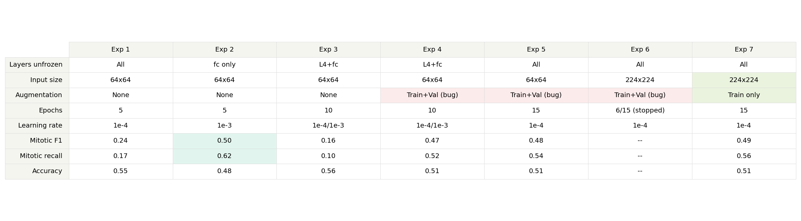
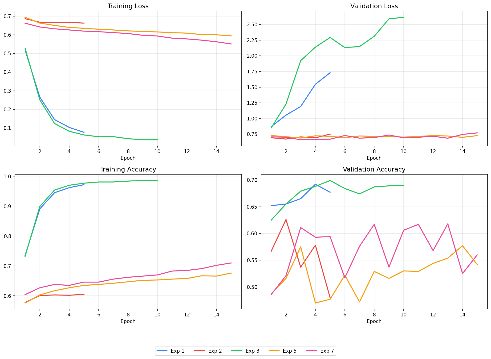
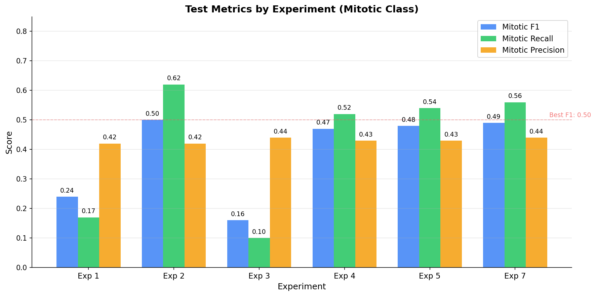

# Mitosis Detector

Binary classification of mitotic figures in histopathology patches from whole-slide images of canine cutaneous mast cell tumors (CCMCT).

## Dataset

**Source:** [MITOS_WSI_CCMCT](https://www.kaggle.com/datasets/marcaubreville/mitosis-wsi-ccmct-training-set) — 32 whole-slide DICOM images with 262,481 expert annotations.

**Reference:** Bertram, C. A., Aubreville, M., Marzahl, C., Maier, A., & Klopfleisch, R. (2019). A large-scale dataset for mitotic figure assessment on whole slide images of canine cutaneous mast cell tumor. *Scientific Data*, 6(274), 1–9.

**Annotation classes:**

| Class | Label | Extracted patches |
|-------|-------|-------------------|
| 1 | Granulocyte | 35,331 |
| 2 | Mitotic figure | 21,036 |
| 3 | Tumor cell | 45,178 |
| 4 | Other/ambiguous | 41,656 |
| 7 | MF lookalike | 3,029 |

**Total extracted:** 146,230 patches (64×64 px) from 21 training slides.

## Project Structure

```
mitosis-detector/
├── README.md
├── .gitignore
├── requirements.txt
├── config.py                   # Centralized paths
├── setup_data.py               # Extract metadata from SQLite
├── extract_patches.py          # Extract 64×64 patches from WSIs
├── wsi_utils.py                # DICOM tile reading, normalization, patch extraction
├── eda.ipynb                   # Exploratory data analysis
├── train.py                    # Model training
├── evaluate.py                 # Test evaluation with metrics
└── data_segregation_status.py  # Monitor extraction progress
```

## Usage

### 1. Download the dataset

Download the [MITOS_WSI_CCMCT training set](https://www.kaggle.com/datasets/marcaubreville/mitosis-wsi-ccmct-training-set) from Kaggle. The download includes DICOM whole-slide images and a SQLite database with annotations.

### 2. Configure paths

Edit `config.py` and set `BASE_DIR` to point to your local dataset directory.

### 3. Setup directories and extract metadata

```bash
python setup_data.py
```

Creates the directory structure and extracts annotation tables from the SQLite database as CSVs.

### 4. Extract patches from WSIs

```bash
python extract_patches.py
```

Reads DICOM whole-slide images, maps annotations to tiles, and extracts 64×64 patches into `mitotic/` and `non_mitotic/` directories using multiprocessing. Supports resumable extraction — skips patches that already exist on disk.

### 5. Train the model

```bash
python train.py
```

### 6. Evaluate on test set

```bash
python evaluate.py
```

## Data Pipeline

### Extraction

Each WSI is a tiled DICOM file. The extraction pipeline maps each annotation's slide-level coordinates to a specific tile, decodes only tiles that contain annotations (skipping the rest for speed), and extracts a 64×64 patch centered on each annotated cell. Patches near tile edges are zero-padded.

### EDA findings

Analysis of the 146,230 extracted patches revealed significant data quality issues:

- **~20% of patches** have black padding covering >10% of the image (tile-edge artifacts)
- **~35% of patches** are near-blank (mean pixel intensity >220, empty tissue regions)
- Distribution is consistent across classes — the problem is tile-edge extraction, not class-specific

After filtering out black-padded and blank patches:

| Class | Original | Clean | Dropped |
|-------|----------|-------|---------|
| Granulocyte (1) | 35,331 | 13,611 | 21,720 |
| Mitotic figure (2) | 21,036 | 11,954 | 9,082 |
| Tumor cell (3) | 45,178 | 21,995 | 23,183 |
| Ambiguous (4) | 41,656 | 18,127 | 23,529 |
| MF lookalike (7) | 3,029 | 1,640 | 1,389 |
| **Total** | **146,230** | **67,327** | **78,903** |

### Training data

Class 4 (ambiguous) was excluded from training — these are annotations where expert pathologists disagreed on the label. Training on uncertain labels adds noise.

Final training dataset: **49,200 clean patches** (11,954 mitotic, 37,246 non-mitotic, 3.1:1 imbalance).

## Slide-Level Splits

Patches are split by slide, not randomly, to prevent data leakage. Patches from the same slide share staining characteristics — a random split would let the model memorize slide-specific patterns instead of learning what mitosis looks like.

| Split | Slides | Mitotic | Non-mitotic | Total |
|-------|--------|---------|-------------|-------|
| Train (14 slides) | 4, 7, 12, 13, 15, 17, 23, 25, 28, 29, 32, 34, 35, 36 | 5,957 | 27,512 | 33,469 |
| Val (4 slides) | 8, 14, 22, 24 | 1,265 | 3,337 | 4,602 |
| Test (3 slides) | 19, 21, 26 | 4,732 | 6,397 | 11,129 |

Mitotic-rich slides (4, 7, 12, 13, 14, 19, 21) are distributed across all three splits. Test slides 19 and 21 are completely unseen during training.

## Experiment Results

All experiments use ResNet-18 pretrained on ImageNet with the final `fc` layer replaced by `Linear(512, 1)`, trained with Adam optimizer, BCEWithLogitsLoss, and WeightedRandomSampler (to handle 3.1:1 class imbalance), batch size 64.

### Experiment summary



| | Exp 1 | Exp 2 | Exp 3 | Exp 4 | Exp 5 | Exp 6 | Exp 7 |
|---|---|---|---|---|---|---|---|
| Layers unfrozen | All | fc only | L4+fc | L4+fc | All | All | All |
| Input size | 64×64 | 64×64 | 64×64 | 64×64 | 64×64 | 224×224 | 224×224 |
| Augmentation | None | None | None | Train+Val (bug) | Train+Val (bug) | Train+Val (bug) | Train only |
| Epochs | 5 | 5 | 10 | 10 | 15 | 6 (stopped) | 15 |
| Learning rate | 1e-4 | 1e-3 | 1e-4/1e-3 | 1e-4/1e-3 | 1e-4 | 1e-4 | 1e-4 |
| Mitotic F1 | 0.24 | **0.50** | 0.16 | 0.47 | 0.48 | -- | 0.49 |
| Mitotic recall | 0.17 | **0.62** | 0.10 | 0.52 | 0.54 | -- | 0.56 |
| Accuracy | 0.55 | 0.48 | **0.56** | 0.51 | 0.51 | -- | 0.51 |

### Bugs found and fixed

**Bug 1 — No input resize (Exps 1–5):** 64×64 images fed directly into ResNet-18 resulted in 2×2 feature maps by layer4. ResNet was designed for 224×224 inputs — the aggressive downsampling destroyed spatial information before the model could learn from it. Fixed in Exp 6 by adding `Resize(224, 224)`.

**Bug 2 — Augmentation on validation data (Exps 4–6):** Random flips, rotations, and color jitter were applied to validation and test data through a shared transform. This caused validation accuracy to bounce randomly each epoch (47%–62%), making it impossible to assess true model performance. Fixed in Exp 7 by using separate transforms for training (with augmentation) and evaluation (resize + normalize only).

### Training curves



Exp 1 and Exp 3 show severe overfitting — train loss drops near zero while val loss climbs past 2.0. Unfreezing all layers without augmentation allows the model to memorize the 5,957 mitotic training patches. Exp 2 (frozen backbone) avoids overfitting but underfits — only the fc layer's 513 parameters can't learn histopathology-specific features from ImageNet representations. Exps 4–6 show noisy val metrics from the augmentation bug. Exp 7 shows the cleanest training dynamics — steady loss decline without severe overfitting.

### Test metrics



Best mitotic recall: Exp 2 (0.62). Best mitotic F1: Exp 2 (0.50). Exp 7 — the first properly configured experiment — achieves F1=0.49, recall=0.56. The slide-level split creates a significant domain gap between training and test slides, which is the primary bottleneck.

## Key Learnings

- **Data quality matters more than model architecture.** 54% of extracted patches were garbage (black padding or blank tissue). Filtering these before training is essential.
- **Slide-level splits are necessary but brutal.** Random splits give artificially inflated metrics due to staining leakage. Proper splits reveal the true generalization gap.
- **Augmentation prevents overfitting but doesn't fix underfitting.** With augmentation, the train-val gap closed dramatically, but the model still couldn't learn discriminative features for unseen slides.
- **Input resolution matters for pretrained models.** Feeding 64×64 images into ResNet-18 (designed for 224×224) cripples the feature extraction — a basic mistake that wasted multiple training runs.
- **Debugging is part of the process.** Two bugs (missing resize, augmentation leaking to validation) were discovered through systematic experimentation, not code review.

## Next Steps

- Threshold tuning (current default: 0.5) to optimize precision-recall tradeoff
- Learning rate scheduling (cosine annealing or ReduceLROnPlateau)
- Stain normalization to reduce domain gap between slides
- Include class 4 (ambiguous) patches as hard negatives to improve robustness
- Save best model checkpoint based on val F1 rather than using the last epoch
