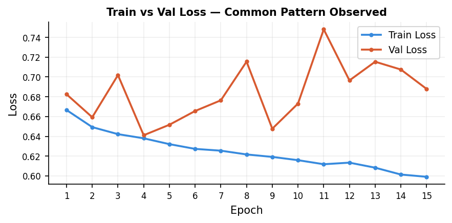

# Mitosis Detector

Binary classification of mitotic figures in histopathology whole-slide images of canine cutaneous mast cell tumors (CCMCT).

## Dataset

32 whole-slide DICOM images (21 training + 11 test) with 262,481 expert annotations across all 32 slides. This project uses the 21 training slides.

**Source:** [Training](https://www.kaggle.com/datasets/marcaubreville/mitosis-wsi-ccmct-training-set) | [Testing](https://www.kaggle.com/datasets/marcaubreville/mitosis-wsi-ccmct-test-set/data)

**Reference:** Bertram, C. A., Aubreville, M., Marzahl, C., Maier, A., & Klopfleisch, R. (2019). A large-scale dataset for mitotic figure assessment on whole slide images of canine cutaneous mast cell tumor. *Scientific Data*, 6(274), 1–9.

**Annotation classes:**

| Class | Label |
|-------|-------|
| 1 | Granulocyte |
| 2 | Mitotic figure |
| 3 | Tumor cell |
| 4 | Other/ambiguous |
| 5 | Binucleated cell |
| 6 | Multinucleated cell |
| 7 | Mitotic figure lookalike |

Classes 5 and 6 were defined in the annotation schema but no cells of those classes were annotated in the training or testing slides.

## Project Structure

```
mitosis-detector/
├── README.md
├── .gitignore
├── requirements.txt
├── config.py                   # Centralized paths and settings
├── setup_data.py               # Extract metadata tables from SQLite database
├── extract_patches.py          # Extract 64×64 patches from DICOM WSIs
├── wsi_utils.py                # DICOM tile reading, normalization, patch extraction
├── eda.ipynb                   # Exploratory data analysis and patch cleaning
├── model_utils.py              # Model architecture, hyperparameters, transforms, and slide splits
├── train.py                    # Model training with slide-level splits
├── evaluate.py                 # Evaluation with precision, recall, F1
└── data_segregation_status.py  # Monitor extraction progress
```

## Usage

### 1. Clone the repository

```bash
git clone https://github.com/shanthan5589/mitosis-detector.git
cd mitosis-detector
```

### 2. Install dependencies

```bash
pip install -r requirements.txt
pip install kaggle
```

 **Kaggle API setup:** Go to kaggle.com → Your Profile → Settings → API → Create New Token. This downloads `kaggle.json`. Place it at:
 - Linux/Mac: `~/.kaggle/kaggle.json`
 - Windows: `C:\Users\<YourUsername>\.kaggle\kaggle.json`

### 3. Download the dataset

```bash
kaggle datasets download -d marcaubreville/mitosis-wsi-ccmct-training-set -p "data" --unzip
```

```bash
kaggle datasets download -d marcaubreville/mitosis-wsi-ccmct-test-set -p "data" --unzip
```

### 4. Configure paths

All scripts import their paths from `config.py`, so it must be configured correctly before running anything.
```bash
config.py
```

### 5. Extract metadata

Creates the required subdirectory structure and extracts annotation tables from the SQLite database as CSVs:

```bash
python setup_data.py --split train
```

```bash
python setup_data.py --split test
```

### 6. Extract patches

Reads DICOM whole-slide images and extracts 64×64 patches into `mitotic/` and `non_mitotic/` directories. Resumable — skips patches already on disk.

```bash
python extract_patches.py --split train
```

```bash
python extract_patches.py --split test
```

To monitor extraction progress in a separate terminal while it runs:

```bash
python data_segregation_status.py --split train
```

### 7. Clean patches

Open `eda.ipynb` and run all cells. Filters out black-padded and near-blank patches and writes `clean_paths.txt` to training data directory.

### 8. Train

```bash
python train.py
```

Saves the best model checkpoint to `model.pth` based on validation F1.

### 9. Evaluate

```bash
python evaluate.py --split val
```

```bash
python evaluate.py --split test
```

## Data Pipeline

### The core challenge: DICOM whole-slide images

Each WSI is a tiled DICOM file — not a regular image. A single slide can be several gigabytes. The extraction pipeline:

1. Reads slide metadata (tile dimensions, total matrix size) from DICOM headers
2. Maps each annotation's slide-level (x, y) coordinates to a specific tile index
3. Streams through tiles using `iter_pixels`, decoding **only tiles that contain annotations** — skipping the rest entirely for speed
4. Extracts a 64×64 patch centered on each annotated cell.
5. Zero-pads patches that fall near tile edges.

This approach avoids loading entire slides into memory and makes extraction feasible on a standard machine.

### EDA findings

1,000 patches per class were sampled to assess data quality. Two problems were found:

| Class | Black padding >10% | Plain (intensity >220) |
|-------|-------------------|----------------------------|
| Granulocyte | 18.2% | 46.1% |
| Mitotic figure | 17.7% | 27.6% |
| Tumor cell | 19.4% | 31.1% |
| Ambiguous | 19.1% | 37.1% |
| Mitotic figure lookalike | 19.0% | 27.7% |

So, both filters were applied to all 146,230 patches.

| Class | Total | Clean | Dropped |
|-------|-------|-------|---------|
| Granulocyte (1) | 35,331 | 13,611 | 21,720 |
| Mitotic figure (2) | 21,036 | 11,954 | 9,082 |
| Tumor cell (3) | 45,178 | 21,995 | 23,183 |
| Ambiguous (4) | 41,656 | 18,127 | 23,529 |
| Mitotic figure lookalike (7) | 3,029 | 1,640 | 1,389 |
| **Total** | **146,230** | **67,327** | **78,903** |

54% of patches were dropped. 
Class 4 (other/ambiguous) was also excluded from training — it is unknown whether these cells are mitotic or not, so including them would add unreliable labels. After exclusion:

Final training data: 49,200 patches:
- Mitotic: 11,954 
- Non-mitotic: 37,246 
- Class imbalance: 3.1:1

### Slide-level splits

Patches were not split randomly. If patches from slide 4 appear in both train and val, the model learns slide 4's specific staining appearance and gets rewarded for it during validation — that is memorization, not generalization.

The correct approach is a slide-level split: all patches from a given slide go entirely into one set.

Per-slide breakdown across all 21 slides:

| Slide | Mitotic | Non-mitotic | Total | Split |
|-------|---------|-------------|-------|-------|
| 4 | 2,875 | 6,470 | 9,345 | Train |
| 7 | 948 | 3,485 | 4,433 | Val |
| 8 | 54 | 237 | 291 | Val |
| 12 | 847 | 3,351 | 4,198 | Train |
| 13 | 685 | 2,306 | 2,991 | Train |
| 14 | 1,183 | 1,708 | 2,891 | Val |
| 15 | 188 | 885 | 1,073 | Train |
| 17 | 371 | 1,774 | 2,145 | Train |
| 19 | 2,184 | 2,402 | 4,586 | Train |
| 21 | 2,547 | 3,672 | 6,219 | Train |
| 22 | 26 | 644 | 670 | Train |
| 23 | 0 | 1,328 | 1,328 | Val |
| 24 | 2 | 748 | 750 | Train |
| 25 | 7 | 1,077 | 1,084 | Train |
| 26 | 1 | 323 | 324 | Train |
| 28 | 0 | 606 | 606 | Train |
| 29 | 7 | 1,940 | 1,947 | Train |
| 32 | 6 | 1,412 | 1,418 | Train |
| 34 | 0 | 767 | 767 | Train |
| 35 | 19 | 1,351 | 1,370 | Train |
| 36 | 4 | 760 | 764 | Train |

| Split | Slides | Mitotic | Non-mitotic | Total |
|-------|--------|---------|-------------|-------|
| Train (17 slides) | 4, 12, 13, 15, 17, 19, 21, 22, 24, 25, 26, 28, 29, 32, 34, 35, 36 | 9,769 | 30,488 | 40,257 |
| Val (4 slides) | 7, 8, 14, 23 | 2,185 | 6,758 | 8,943 |

Slide 23 (0 mitotic cells) was deliberately placed in the val set. A model that has genuinely learned what mitosis looks like should produce very few false positives on slide 23. If it doesn't, the model is pattern-matching noise, not learning the actual biology.


## Why F1 is limited with a single classifier:

With the current slide split across training and validation set, it has been observed that the model across all experiments is overfitting the training data and I have tried different regularization techniques and model architectures to improve the F1 for the positive class but they didn't work quite well. 



The techniques that I tried that I thought would work but they didn't:
- Weighted Random Sampler (there was a lot of class imbalance)
- Using pos_weight in BCEWithLogitsLoss (pytorch)
- Frozen all layers except the fc layer. 
- Frozen all layers except Layer-4 and fc.
- Augmentation - changing brightness and contrast.
- Resizing the input images.
- Reducing Learning Rate.
- Using LR scheduler.
- Changed conv1 to stride=1 and replaced maxpool with Identity so that last layer would get more spatial data (Breaks Transfer Learning).
- Using Resnet-50
- Using Efficient net B0

The max F1 for the positive class I could achieve was ~0.439. 
Achieving a high F1 using a single classifier is tough because there is a lot of domain gap between training and validation slides i.e the staining varied a lot across training and validation slides so the model found it very hard to generalize the pattern of a mitotic cell, as a result the model was performing well on training data and worse on validation data.
So it was clear for me that I cannot achieve a better F1 with only a single classifier.

The data was extracted on my computer, but to fine-tune dense CNNs, you need a lot of compute, I personally have NVIDIA-3050 which wasn't enough, so I uploaded all the training and testing data along with all my scripts to kaggle and fine-tuned CNNs using NVIDIA-T4 GPU's available on Kaggle for free.

I know that this specific project couldn't achieve a high F1 score but I came to know various techniques that I could try when model breaks down and learn how gigabytes of data is broken down into simple 64×64 patches in a efficient data pre-processing pipeline.

## Key Learnings

- **Raw DICOM WSI data requires significant preprocessing.** 54% of extracted patches were garbage and had to be filtered before training. This kind of data cleaning is the unglamorous but essential foundation of any real ML project.
- **Slide-level splits are non-negotiable in medical imaging.** Random splits produce inflated, misleading metrics. Proper splits reveal the true generalization difficulty.
- **Input resolution matters for pretrained models.** Feeding 64×64 patches into ResNet-18 designed for 224×224 cripples the feature extraction pipeline at layer-4.
- **Debugging experiments systematically is more valuable than running more experiments.** Every bug found and understood is more useful than another training run with unknown configuration.
- **Validation set design is as important as training set design. Deliberately including slide 23 (zero mitotic cells) in val to measure false positive rate is a concrete methodological decision, not an afterthought.**
- **Transfer learning assumptions break at small input sizes. ResNet-18 pretrained on 224×224 ImageNet images loses most of its spatial information when fed 64×64 patches — the feature maps collapse to 2×2 by layer4, making the pretrained weights mostly useless.**
- **Using Weighted Random Sampler along with pos_weight in BCEWithLogitsLoss could be too strict and cause the model to underfit the data, so any one the technique should be used to handle class imbalance.**